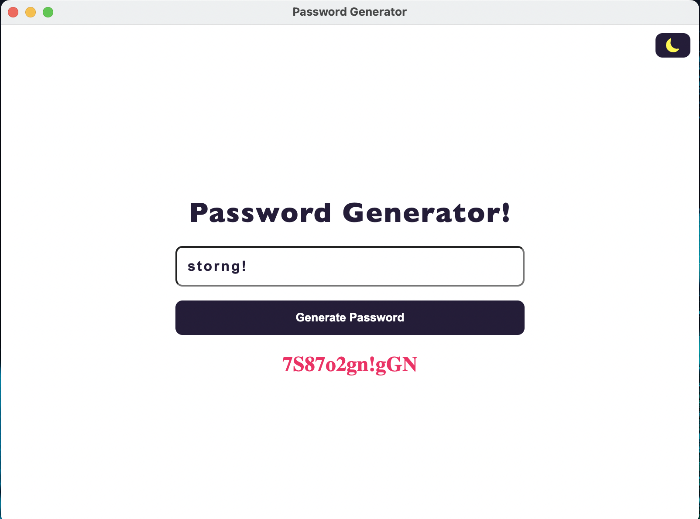

# electron-password-generator
Simple desktop password generator created with Electron



### Install dependencies 
``` yarn ``` or ``` npm install ```

### Run application
``` yarn run start ``` or ``` npm run start ```
